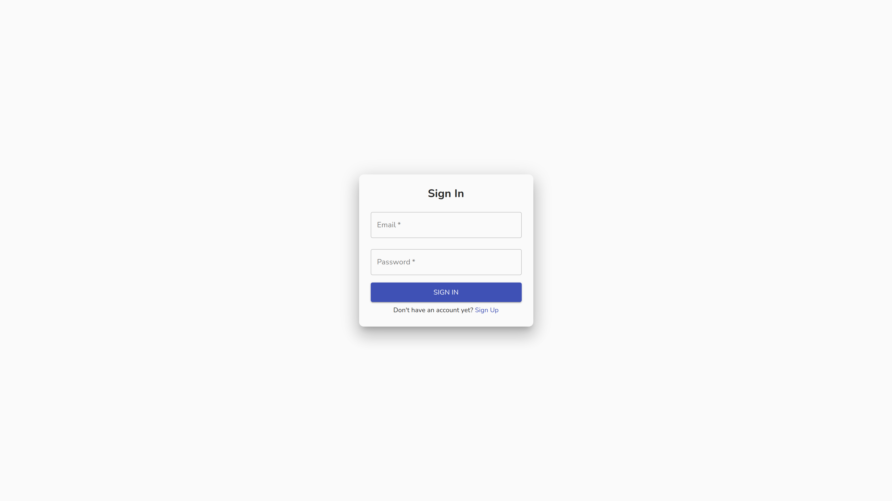

# Next Firebase Example

This is a Firebase authentication example using Next JS and Material UI.

## Technologies:

- [Next.js](https://nextjs.org/)
- [Material UI](https://material-ui.com/)
- [Firebase](https://firebase.google.com/)

## Preview:

<h1 align="center">
  
</h1>

## Getting Started

First, run the development server:

```bash
yarn dev
```

Open [http://localhost:3000](http://localhost:3000) with your browser to see the result.
